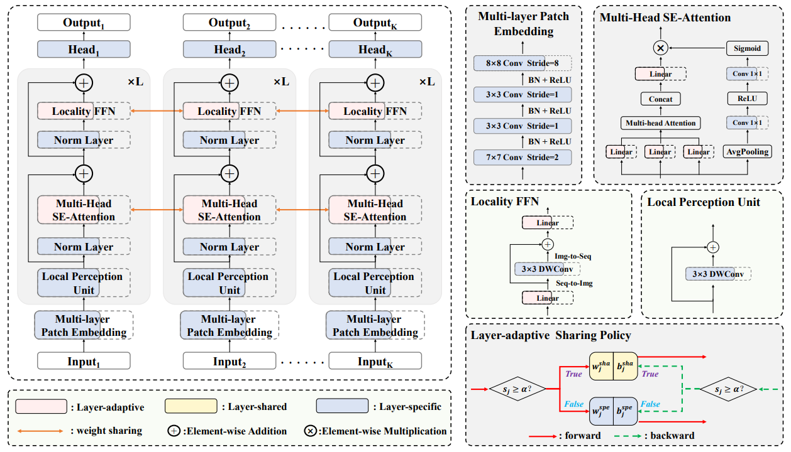
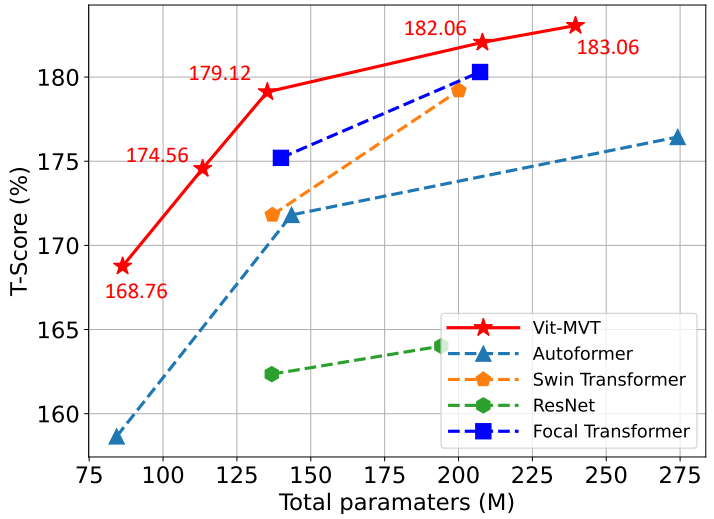
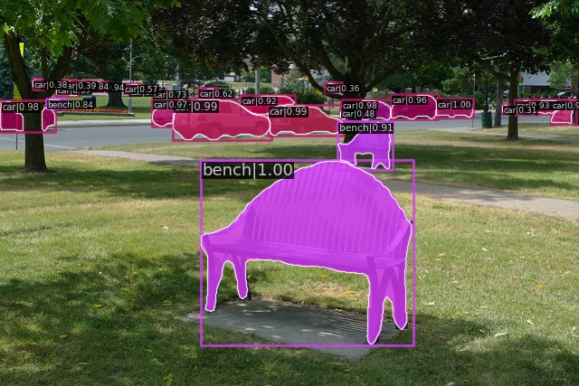
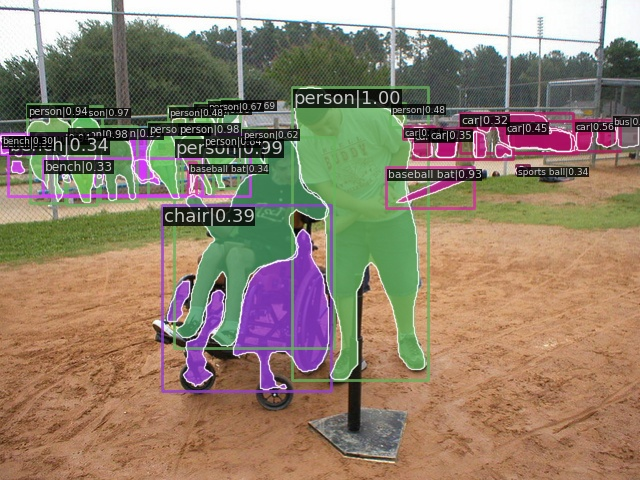

# ViT-MVT: A Unified Vision Transformer Network for Multiple Vision Tasks

**This is an official implementation of ViT-MVT.**

ViT-MVT is a consolidated network that integrates numerous visual tasks into a single and manageable supernet and optimizes them concurrently under various dataset domains.
For the design of ViT-MVT, we augment the vision transformer with a multi-head se-attention (MHSE) to offer complementary cues in the channel and spatial dimension, as well as a local perception unit (LPU) and locality feed forwards network (locality FFN) for information exchange in the local region, thus endowing ViT-MVT with the ability to effectively
optimize multiple tasks. Besides, we construct a search space comprising potential architectures with a broad spectrum of model sizes to offer various optimum candidates for diverse tasks.
After that, we design a layer-adaptive sharing technique that automatically determines whether each layer of the transformer
block is shared or not for all tasks, enabling ViT-MVT to obtain task-shared parameters for a reduction of storage and task-specific parameters to learn task-related features such that boosting performance. Finally, we introduce a joint-task evolutionary search algorithm to discover an optimal backbone for all tasks under total model size constraint, which challenges the
conventional wisdom that visual tasks are typically supplied with backbone networks developed for image classification.



## Highlights
- Once-for-all

ViT-MVT is a simple yet effective method to train a vision transformer supernet for multiple vision tasks.

- Competive performance

ViT-MVT consistently outperform the baseline AutoFormer and other state-of-the-art works.



## Environment Setup

To set up the enviroment you can easily run the following command:

- Create environment

```buildoutcfg
conda create -n Vitmvt python=3.7
conda activate Vitmvt
```

- Install torch, we verify Vit-MVT with pytorch 1.10.1 and cuda 11.3.

```buildoutcfg
conda install pytorch==1.10.1 torchvision==0.11.2 torchaudio==0.10.1 cudatoolkit=11.3 -c pytorch -c conda-forge
```

- Install openmmlab packages.

```buildoutcfg
pip install mmcv-full==1.5.0
pip install mmcls==0.23.1
pip install mmdet==2.24.1
pip install mmsegmentation==0.24.1
```

- Install ViT-MVT

```buildoutcfg
cd vitmvt 
pip install -e .
```

## Data Preparation 
You need to first download the ImageNet-2012 to the folder `./data/imagenet`, COCO-2017 to the folder `./data/coco`, and ADE20K to the folder `./data/ade20k`. 

## Model Zoo 
For evaluation, we provide the checkpoints of our models in [Google Drive](https://drive.google.com/drive/folders/1M4Knz3V-uGTSHUoxigZnlAiy3qMClJuE?usp=sharing). 

After downloading the models, you can do the evaluation following the description in *Quick Start - Test*).

Model download links:

Model | Total Params. | Top-1 Acc. % | mAP % | mIoU % | Download link 
--- |:---:|:---:|:---:|:---:|:---:
ViT-MVT-T|86.3M|78.7|44.5|45.56|[Google Drive](https://drive.google.com/drive/folders/1hCzl83ACiQYpuAVsSwsQqN6TJJUNTVrN?usp=sharing)
ViT-MVT-S|135.3M|82.4|47.3|49.42|[Google Drive]()
ViT-MVT-B|239.6M|83.2|49.4|50.46|[Google Drive](https://drive.google.com/drive/folders/1Gsm8-cB4rJMeBoX-42EJHujnUAyZ8u-a?usp=sharing)

- Note: We do not integrate these models into a single one. You can manually integrate these models into a single one according to the learnable score of each layer so as to reduce storage cost.  

## Quick Start

We provide *Test* code of ViT-MVT as follows: 

### Test
To test our trained models, you need to put the downloaded model in `/PATH/TO/CHECKPOINT`. After that you could use the following command to test the model (Please change your config file and model checkpoint according to different models. Here we use the ViT-MVT-T as an example).

- Classification task
```buildoutcfg
cd vitmvt
python tools/test.py configs/nas/vit_mvt_tiny/task_cls.py /PATH/TO/CHECKPOINT --work-dir $WORK_DIR --eval accuracy
```

- Detection task
```buildoutcfg
cd vitmvt
python tools/test.py configs/nas/vit_mvt_tiny/task_det.py /PATH/TO/CHECKPOINT --work-dir $WORK_DIR --eval bbox
```

- Segmentation task
```buildoutcfg
cd vitmvt
python tools/test.py configs/nas/vit_mvt_tiny/task_seg.py /PATH/TO/CHECKPOINT --work-dir $WORK_DIR --eval mIoU
```

## Visualization

We give some visualizations of ViT-MVT-B for object detection and semantic segmentation as follows:

- Object detection

<div align="half">
    
    
    
</div>

- Semantic segmentation

<div align="half">
    
    
    
</div>

## Demo

We give two demos of visualization for instance segmentation on COCO dataset and semantic segmentation on ADE20K. 
You can utilize the trained ViT-MVT to run the demo. 

## Additional Notes

- We do not intend to release the ViT-MVT training code due to the the training code is related to the enterprise source code.
